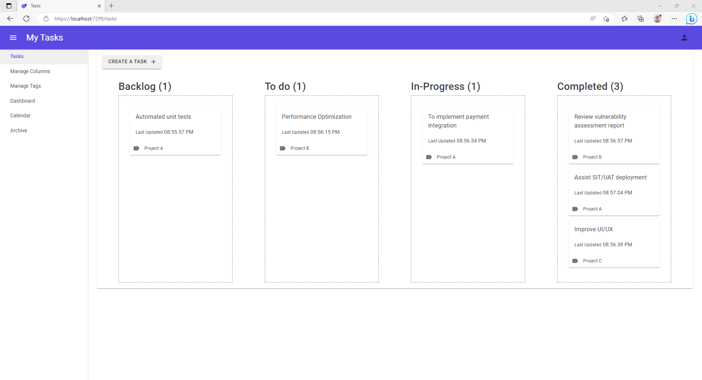
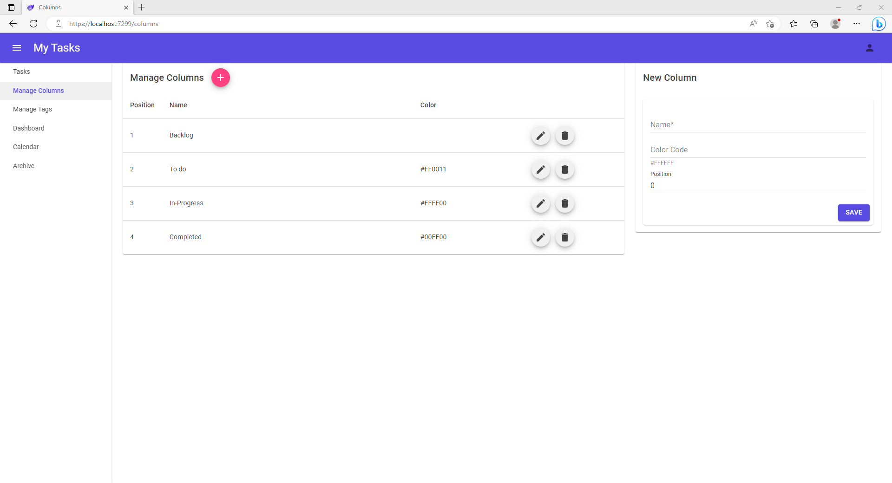
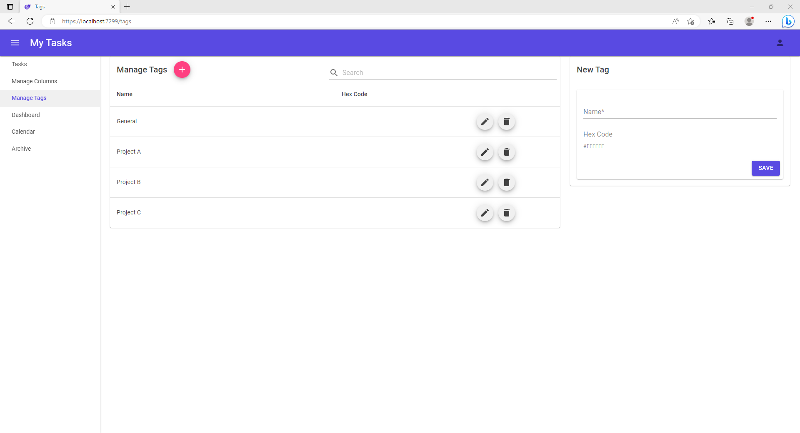
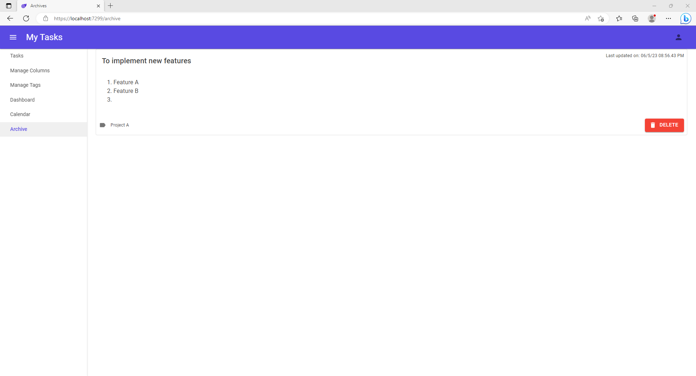
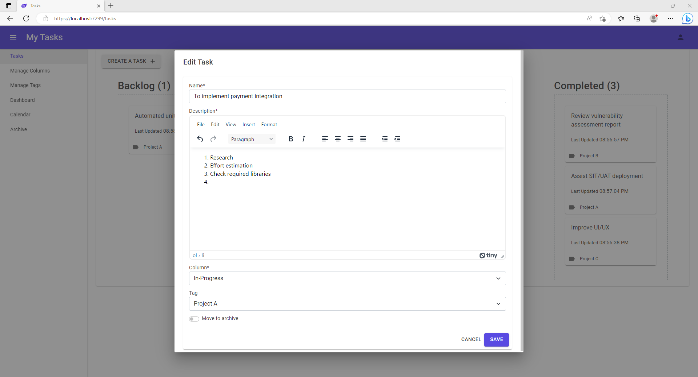

# MyTasks

## Background
A simple project to manage daily tasks.

This is a demo project using the following technologies.

## Technologies used
* C#
* .NET 7
* Blazor Server
* Entity Framework Core
* SQL Express
* Bootstrap
* [MudBlazor](https://mudblazor.com)

## Screenshots

  
  
  
  
  

## Reference
* https://dotnet.microsoft.com/en-us/apps/aspnet/web-apps/blazor
* https://chrissainty.com/investigating-drag-and-drop-with-blazor/
* https://mudblazor.com
